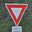
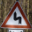
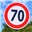
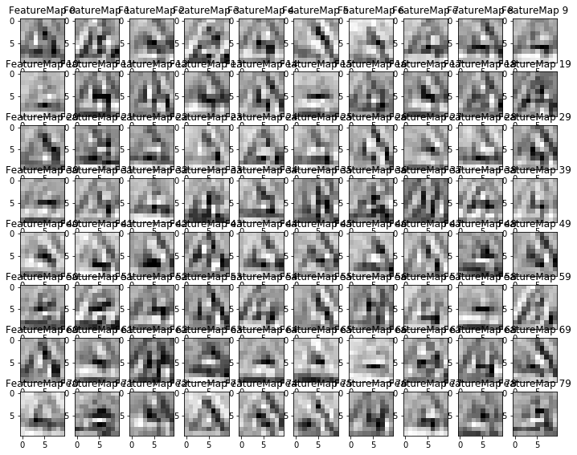

# **Traffic Sign Recognition**

Recognition and classification of traffic signs with help of Deep Learning algorithms

---

**Build a Traffic Sign Recognition Project**

The goals / steps of this project are the following:
* Load the data set (see below for links to the project data set)
* Explore, summarize and visualize the data set
* Design, train and test a model architecture
* Use the model to make predictions on new images
* Analyze the SoftMax probabilities of the new images
* Summarize the results with a written report

---

### Data Set Summary & Exploration

#### 1. Provide a basic summary of the data set

To calculate base data statistic I used standard NumPy functions.
Results are:

* The size of training set is **34'799** samples
* The size of the validation set is **4'410** samples
* The size of test set is **12'630** samples
* The shape of a traffic sign image is **(32, 32, 3)**
* The number of unique classes/labels in the data set is **43**

#### 2. Include an exploratory visualization of the dataset

##### **Training data**
Here is an exploratory visualization of the training data set. The blue bars showing number of samples in the training set.

**Details**

| Class | Description | Number of samples
|:-----:|:-----------:|:-----------------:
|  0 | Speed limit (20km/h) | 180
|  1 | Speed limit (30km/h) | 1980
|  2 | Speed limit (50km/h) | 2010
|  3 | Speed limit (60km/h) | 1260
|  4 | Speed limit (70km/h) | 1770
|  5 | Speed limit (80km/h) | 1650
|  6 | End of speed limit (80km/h) | 360
|  7 | Speed limit (100km/h) | 1290
|  8 | Speed limit (120km/h) | 1260
|  9 | No passing | 1320
| 10 | No passing for vehicles over 3.5 metric tons | 1800
| 11 | Right-of-way at the next intersection | 1170
| 12 | Priority road | 1890
| 13 | Yield | 1920
| 14 | Stop | 690
| 15 | No vehicles | 540
| 16 | Vehicles over 3.5 metric tons prohibited | 360
| 17 | No entry | 990
| 18 | General caution | 1080
| 19 | Dangerous curve to the left | 180
| 20 | Dangerous curve to the right | 300
| 21 | Double curve | 270
| 22 | Bumpy road | 330
| 23 | Slippery road | 450
| 24 | Road narrows on the right | 240
| 25 | Road work | 1350
| 26 | Traffic signals | 540
| 27 | Pedestrians | 210
| 28 | Children crossing | 480
| 29 | Bicycles crossing | 240
| 30 | Beware of ice/snow | 390
| 31 | Wild animals crossing | 690
| 32 | End of all speed and passing limits | 210
| 33 | Turn right ahead | 599
| 34 | Turn left ahead | 360
| 35 | Ahead only | 1080
| 36 | Go straight or right | 330
| 37 | Go straight or left | 180
| 38 | Keep right | 1860
| 39 | Keep left | 270
| 40 | Roundabout mandatory | 300
| 41 | End of no passing | 210
| 42 | End of no passing by vehicles over 3.5 metric tons | 210

**Conclusion**
Training data set is not equally distributed. Some classes have in 10+ times more examples than other. As result, these classes will be much better trained than other. And model will prone to false positive recognitions of these classes.

### Design and Test a Model Architecture

#### 1. Describe how you preprocessed the image data - Training set equalization and augmentation

To understand what data present in data set, I exported all images on disk and analyzed it:
* Significant part of images was either too dark or too bright. On the first glance it must not be a huge problem. Convolution operators are used for edge detection and can work with too dark or bright images. But on practice it requires trained model having more parameters. And more data is required to train such models. To achieve more predictable results, I decided normalize images.
* The other thing I discovered, color is not significant for signs recognition, because lighting conditions can be too different and colors of same sign can vary in significant measures. Moreover much signs have same colors, but different notions inside. I decided grayscale images.
* After normalizing I figured out, that some images have parts with huge intensity in comparison with other image parts. It can be reflection of sun or flash or car lights, etc. After that applied filters on all images.
* Since training set was not even, I augmented the dataset by adding more images of classes were falling behind in count. Changing the orientation of the images can help create unique datasets if we need more accuracy.
* Shuffle the training set.

#### 2. Describe what your final model architecture looks like including model type, layers, layer sizes, connectivity, etc.)

My final model consisted of the following layers:

| Layer | Description |
|:-----:|:-----------:|
| Input | 32x32x1 |
| Convolution 5x5 | 1x1 stride, VALID padding |
| ReLU |  |
| MAX pooling	2x2 | 2x2 stride |
| Convolution 3x3 | 1x1 stride, VALID padding |
| ReLU |  |
| Dropout | Probability of dropout 50% |
| Convolution 3x3 | 1x1 stride, VALID padding |
| MAX pooling	2x2 | 2x2 stride |
| Fully connected	| 2000, 120 |
| ReLU |  |
| Fully connected	| 120, 84 |
| ReLU |  |
| Fully connected	| 84, 43 |
| Output layer | 43 (number of classes) |
| Softmax | 	|
| Model loss | Model loss is calculated as sum of Cross-entropy averaged by whole training batch and L2-loss calculated for each weight in fully-connected layers and multiplied by fixed regularization factor	|

Dropouts was used between fully-connected layers and after last convolutional layers. Any dropouts between convolutional layers decreased model performance, so it was not used at all.

#### 3. Describe how you trained your model

To train model adaptive gradient-based Adam optimizer with dropouts was used. This algorithm uses adaptively estimated moments and allow teach model more smoothly than simple gradient descent. Moreover it's included in TensorFlow and can be easy used with standard parameters.

Global optimization parameters:

| Parameter | Value |
|:---------:|:-----:|
| Batch size | 128 |
| Epochs | 10 |
| Learning rate | From 0.0015 |
| Dropout  probability  (full-connected) | 50% |
| Normal distribution  for inital data | Mean = 0.0  Sigma = 0.1 |

Almost all parameters was selected empirical, after set of experiments.

Models training cycle contains several rounds with fixed number of epochs. At the end of each epoch model performance is validated on validation set, model with best performance is saved as final result. First round is started from normally distributed random data with **mean 0.0** and **sigma 0.1**. Each next round is started from last best model. Learning rates for each round are started from the same value for epoch 1 and exponentially decreased for each next epoch.

There is no early termination of learning process, just model selection based on validation set performance. Using dropouts prevents model from overfitting.

#### 4. Describe the approach taken for finding a solution

I started my investigations from standard LeNet model with 2 convolutional layers, 2 fully-connected and one output layer. Model was modified a bit to accept RGB images.

On initial training set this model hardly reached 90% performance. After that I was iteratively changing model architecture and pre-processing methods:
* I gray-scaled and normalized image instead of using RGB format. It allowed decrease number of model parameters and increase it performance.
* I changed model depth - proportional increasing number of channels on convolutional layers and fully-connected layers. It increased number of model parameters quadratically and allowed train models better. Adding model depth as parameter allowed easy try different models with one parameter change. Practically it's not efficient increase model depth in wide ranges, so I tried models with depths from 1 to 3.
* I tried to increase number of fully-connected layers, but performance was not improved.
* Max pooling was used.
* Next idea was increase number of convolutional layers.
* Finally dropouts was added to avoid model overfitting.

My final model results are:
* Validation set accuracy: 96.8%
* Test set accuracy: 95.7%

The reasons why training set had a bit lower performance than validation set - quality of original images is not good, which caused problems with recognition of small details. Convolutional filters naturally do things smoother and, as result, cannot recognize some details at all. Better image resolution must do this process better. Sure, it's not possible receive images of good quality in real time, but it's always possible use series of images to improve single image quality.

### Test a Model on New Images

#### 1. Choose several new German traffic signs found on the web and provide them in the report

Found 6 new German signs and ran the model on them.

Here are new German traffic signs that I found on the web(32x32):

Images have different rotation and scale of signs. Lighting conditions are different. Signs have different size and form of internal elements. Some signs have extra texts or images on it - optional explanation of sign or unexpected elements.

#### 2. Discuss the model's predictions on these new traffic signs and compare the results to predicting on the test set

Here are the results of the prediction:

| No | Image | Expected value | Prediction | Result |
|:--:|:-----:|:--------------:|:----------:|:------:|
|  1 |  | 11 - Right-of-way at the next intersection | 11 - Right-of-way at the next intersection | **True** |
|  2 |  | 13 - Yield | 13 - Yield | **True** |
|  3 |  | 14 - Stop | 14 - Stop | **True** |
|  4 |  | 17 - No entry | 17 - No entry | **True** |
|  5 |  | 21 - Double curve | 21 - Double curve | **True** |
|  6 |  | 3 - Speed limit (60km/h) | 3 - Speed limit (60km/h) | **True** |

#### 3. Describe how certain the model is when predicting on each of the five new images by looking at the Softmax probabilities for each prediction

Let's analyze how certain the model about each prediction of new images. For this purpose let's analyze top 5 Softmax probabilities for each image.

Actual labels             -  [13
                              17
                              11
                              14
                              21  
                               4]
Top five predictions are  -
                            [[13  3 35 25  2]
                             [17 14 34 41 33]
                             [11 28 33 30 27]
                             [14  5 13  3  0]
                             [21 11  5 12 24]
                             [ 4  1  5  0 18]]

### Visualizing the Neural Network

#### 1. Discuss the visual output of your trained network's feature maps. What characteristics did the neural network use to make classifications?

We are able to see the recognition of features by the layers -

#### 2. Conclusion

Convolutional layer is augmenting different edges in the images and forming an augmented abstract concept of each type of image. When we ask for it to make a prediction, it's just letting us know if the model has seen the edges of the new image with respect to the fixed set of labels.

Behavior of convolutional layer is similar to linear edge-detection, but stacked one-by-one and "glued" between. Model has learned to detect important features for particular recognition task, and filter all others unnecessary details.
